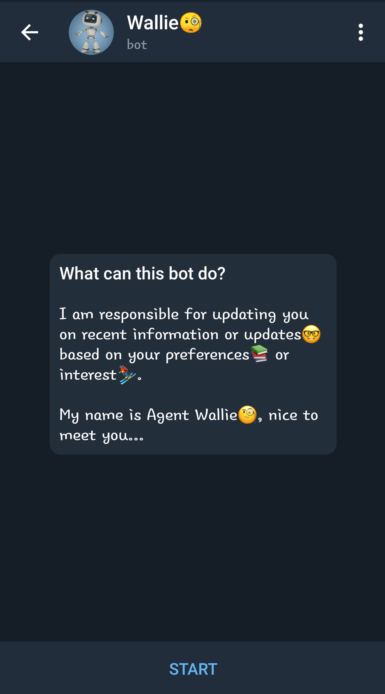
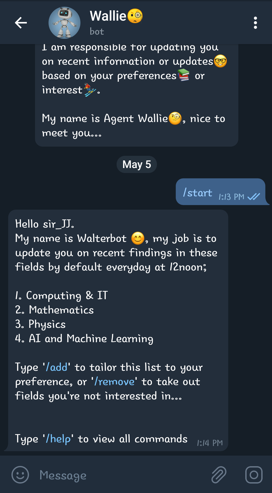
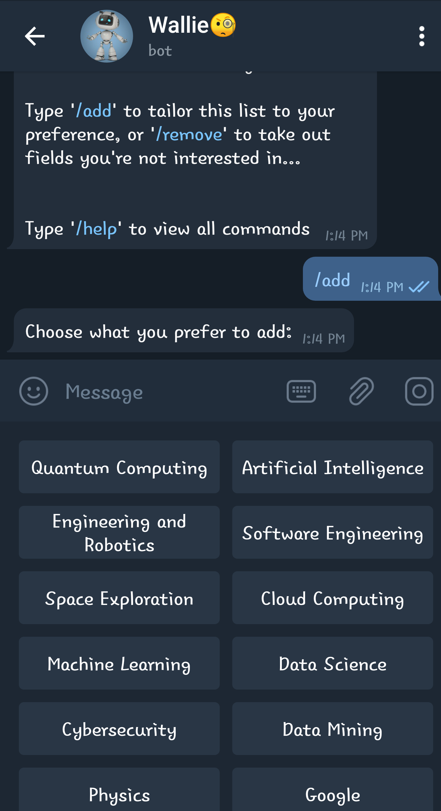
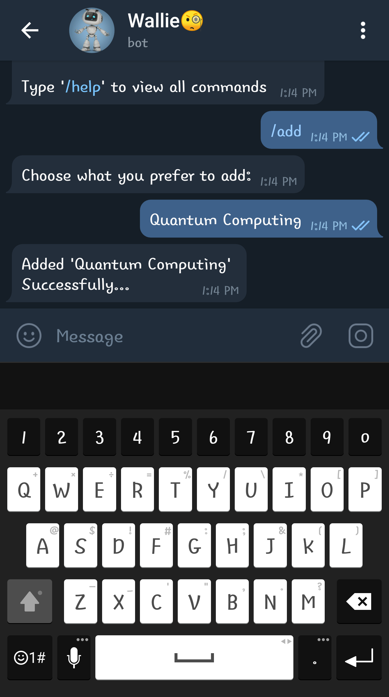
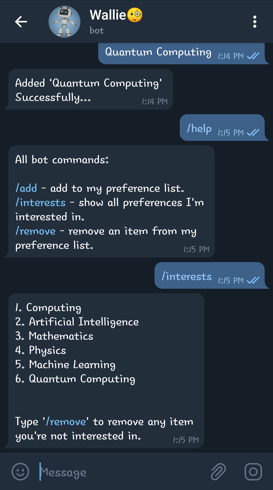
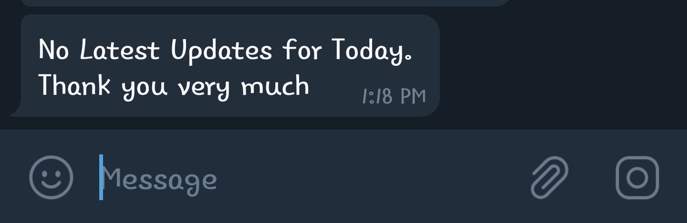
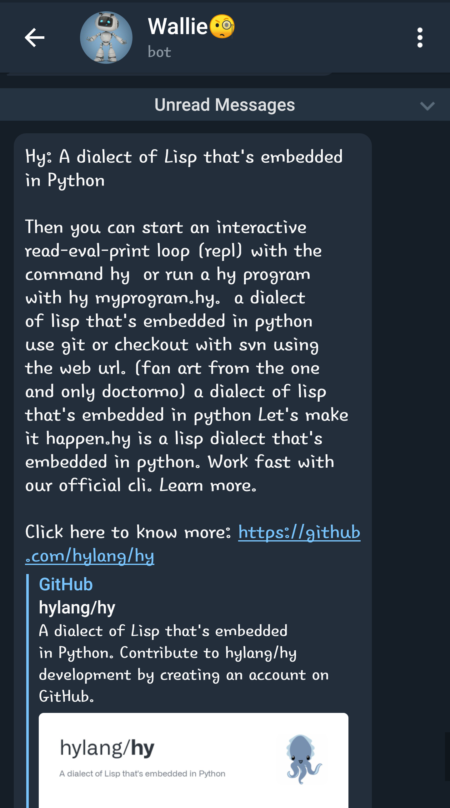
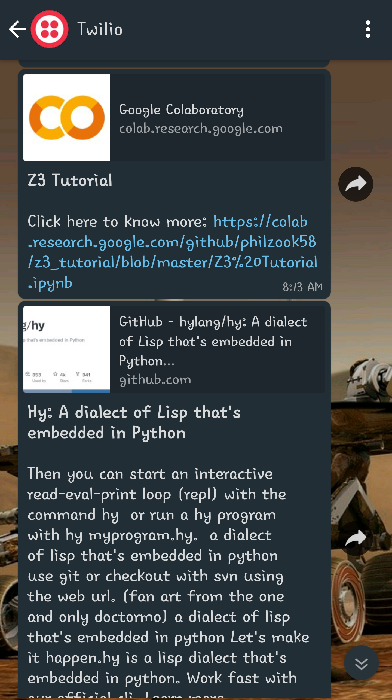

# Wallie🧐 the News Reporter

<!--- These are examples. See https://shields.io for others or to customize this set of shields. You might want to include dependencies, project status and licence info here --->


With the rapid pace of innovation in the tech industry, it can be difficult for tech professionals, programmers, and developers to keep their skills current. That being said, reading technology news and blogs every day is one of the best ways to keep up to date on the latest trends and skills needed in tech.

<!--- Add image --->


Finding a few good articles or blogs to read from, especially ones that are relevant to your area of expertise at your spare time, can be daunting sometimes not to talk of the time spent scrolling through a plethora of articles that don't interest you. What mostly annoys me at times, is the fact that an individual spends his/her precious time to read an article with a "click-bait" title only to realize that the contents has nothing to do with its title! 

Hmn...

<!--- Add image --->


So, after a long time of pain, I decided to create a bot that gets me the right news update I need at a certain time. Yes, I know there are so many options out there to give you and I the same result we need or an even more optimal result but, I just felt like solving my own problem without leveraging on the other Giants like medium, and co... 👀<!-- add an emoji-->

Uniquely for me, I am building a bot that recommends news update for the user based on two variables; **user's preference** and **keywords** in the article (not title because sometimes it can mislead). Then returns to user the "title", "summary of content", and its "link" through Telegram. 😌

First of all, I webscraped and cleaned data from a site, like [Hacker News](https://news.ycombinator.com/news) to get title and link of recent news available. By reading from the link of an article, I figured out next the keywords (list of words which frequently most occurs in the content) of each article. After that, I check whether an item in the preference list given by the user corresponds to any keyword. If it does, get me the summary of that article and update the user through Telegram and Whatsapp (if the need be, using the [Twilio sandbox](https://www.twilio.com/)).

whew!

## Pre-requisites

Before you begin, ensure you have met the following requirements:
<!--- These are just example requirements. Add, duplicate or remove as required --->
* A virtualenv
```python3 -m venv </path/to/new/virtual/environment>```

* You have the version of modules in the requirements.txt file. `requirements.txt` installed in the virtualenv

Or, if not ...

* cd to the directory where requirements.txt is located
* activate your virtualenv

On Windows, run:
```</path/to/virtual/environment>\Scripts\activate.bat```

On Unix or MacOS, run:
```source </path/to/virtual/environment>/bin/activate```

* run: `pip install -r requirements.txt` in your shell


## Description

<!--- Add image --->



`scraper.py` Basically webscrapes data from the hackernews and get the relevant keywords from each article.

`article_summarizer.py` summarizes the content of the article

`job.py` schedules a job or a function to run at the background whilst the main thread runs

`wallie.py` is the brain behind the telegram bot

`post_news.py` further post updates to its user through whatsapp

<!--- Add image showing program runs in session--->

## Check it out

<table>
  <tr>
    <td>Start Bot</td>
    <td>Add to preference list</td>
  </tr>
  <tr>
    <td></td>
    <td></td>
  </tr>
  <tr>
    <td>Item added</td>
    <td>View preference list</td>
  </tr>
  <tr>
    <td></td>
    <td></td>
  </tr>
</table>

When there's no news update for user after searching.



But when there's news...

<table>
  <tr>
    <td>Update me on telegram</td>
    <td>Update me on whatsapp</td>
  </tr>
  </tr>
    <td></td>
    <td></td>
  </tr>
</table>

check out the [Wallie🧐](https://telegram.me/Jnragbo_Bot) in action or run the wallie.py script

```
python3 wallie.py

```

<!--- Add image showing program runs in session--->

You can decide to host the code on [heroku](https://www.heroku.com/) to deploy your version online
